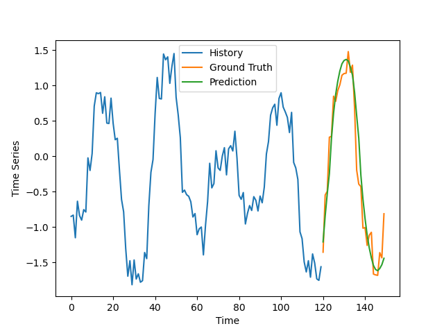
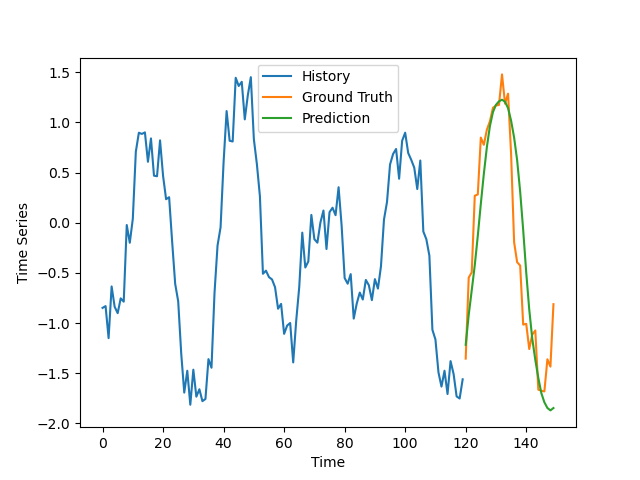
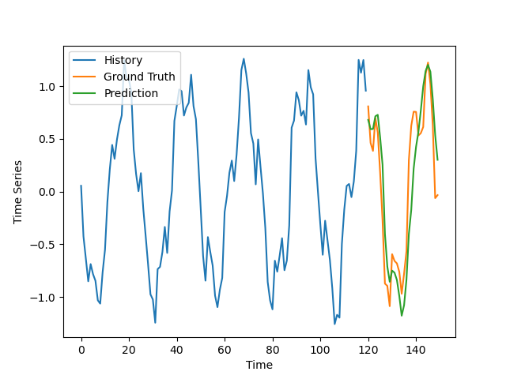
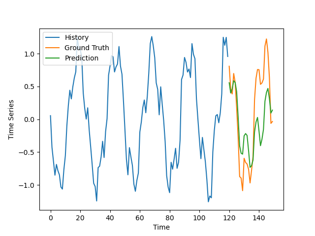
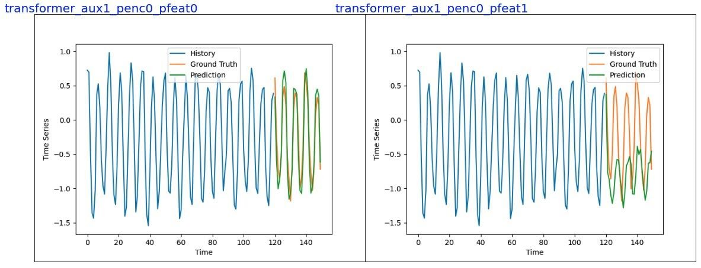
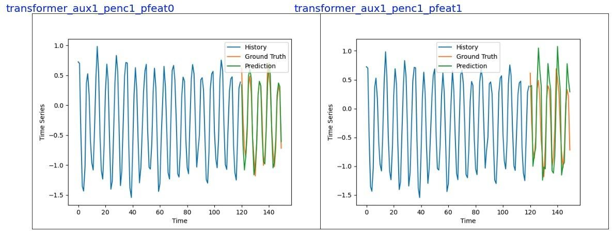

# CSCI 5525: Homework 4
## Title: An comparison of Transformer and LSTM Time-series data forecasting
### Group member: Yijun Lin, Min Namgung
### Date: Dec 17, 2021

This repo is to compare Transformer and LSTM on time series forecasting
Transformer Reference Link: https://github.com/CVxTz/time_series_forecasting

###Transformer vs. LSTM Results:

As you can see, Transformer captures a more accurate prediction than LSTM.

| Tramsformer     | LSTM model
|------------- | -------------
|| 
|| 

### Adding Periodic Positional Encoding:

    The syntatic data are generated based on: A * Cos(Bx + C) + D

    where, A controls the amplitude, B is controlling the periodic of the function, e.g., 7, 14, 28, C is the horizonal shift, and D is the vertical shift

### Test different types of periodic positional encodings on Transformer

| Sign  | Description
|------------- | -------------
|AUX| Auxiliary Features
|Penc| Periodic as Positional Encoding
|Pfeat| Periodic as Extra Features|   
------------- | -----------------------------------------
|0| Not using
|1| Using

|ID    | Transformer with Positional Encoding    |
|------------- |------------- |
|1||
|2||

Model| Using Auxiliary Features | Using Periodic as Positional Encoding | MAE | SMAPE
|------------- |------------- |------------- |------------- |------------- |
|LSTM|1|0|0.29625|47.51880
|Transformer|1|0|0.23089|37.93381
|Transformer|1|1|0.19829|34.05033

### How to run the code:

    Please refer to bash folder how to train/test model

